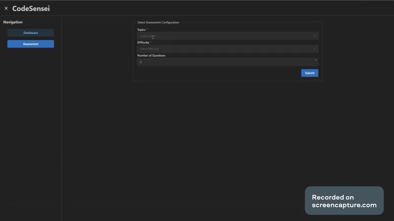
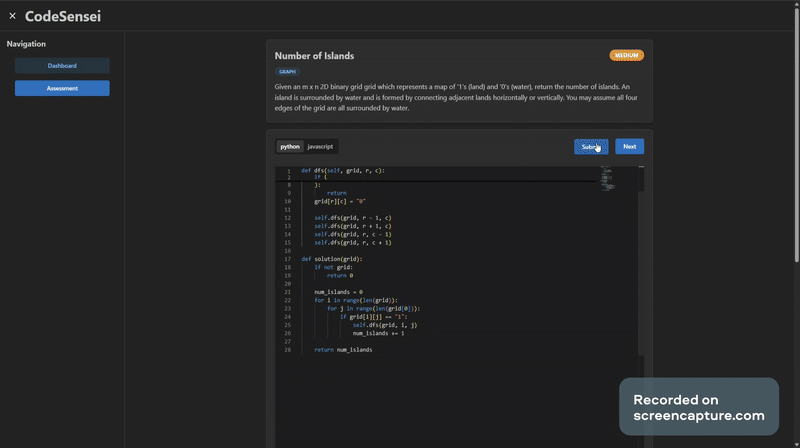
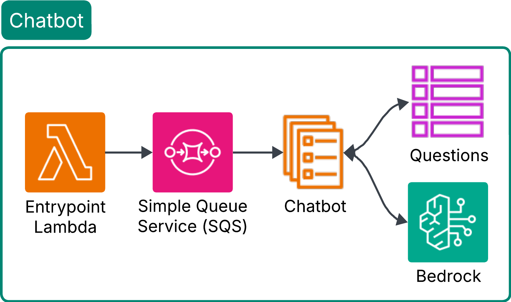

# CodeSensei
CodeSensei is a cloud-native web application that provides AI-managed coding assessments to help software engineers prepare for algorithm interviews. The app is built using a [microservices](https://en.wikipedia.org/wiki/Microservices) architecture on AWS's cloud platform to achieve reliability and scalability.

## Table of Contents
- [Features](#features)
- [System Design](#system-design)
- [Usage](#usage)
- [Contributors](#contributors)

## Features
Preparing for algorithm interviews often involves practicing a subset of LeetCode-style questions filtered by topic (e.g., arrays, graphs) and difficulty (easy, medium, hard). The selection within this subset is typically random and left to the user, making it hard to identify and focus on weak areas. CodeSensei streamlines this process by allowing users to configure their assessments, while dynamically selecting each question within that configuration based on their performance on previous ones. This enables a more personalized and targeted practice experience. To achieve this, we implemented the following features: 

#### User Authentication and Profiles
Users can sign up, log in, and maintain personalized assessment histories. Sign-ups include strong password requirements and email verification to ensure account security.

#### Assessment Configuration
Users can customize each assessment by selecting topics, difficulty levels, and the number of questions they want to attempt.

#### Code Submission
Users can submit code for each question and view its output, along with key performance metrics such as execution time, accuracy, and memory usage.

#### Chatbot Assistance
If users get stuck, they can ask the built-in chatbot for hints or clarifications. To preserve the integrity of the assessment, the chatbot does not provide code or direct answers.

#### Dynamic Question Progression
After completing a question, users can proceed to the next one, which is selected dynamically based on their performance on previous questions within the assessment.

#### Assessment Submission and Metrics
Upon completing all questions, users can submit the assessment and view detailed metrics on time spent, execution time, and memory usage, broken down by topic and difficulty. They can also view aggregate metrics across assessments to benchmark their overall performance.

## System Design

## Contributors
- Aaron Bengochea
- Timothy Cao
- Janardhan Reddy
- Allan Thekkepeedika
