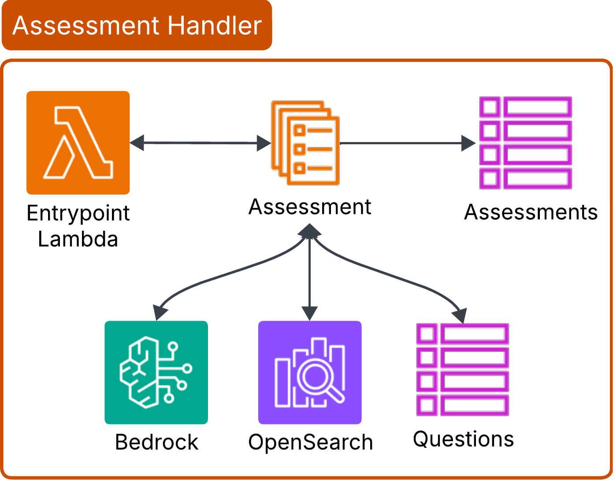
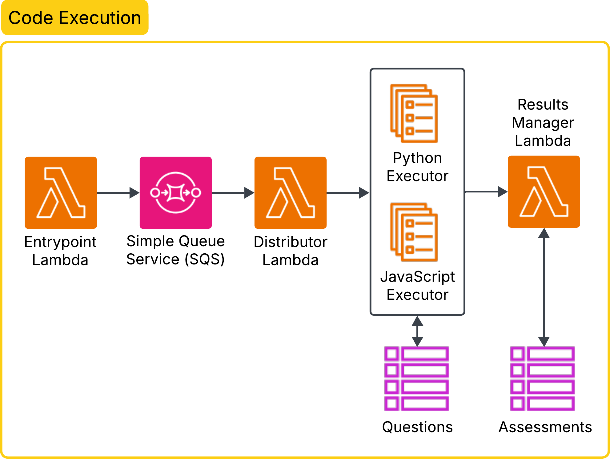
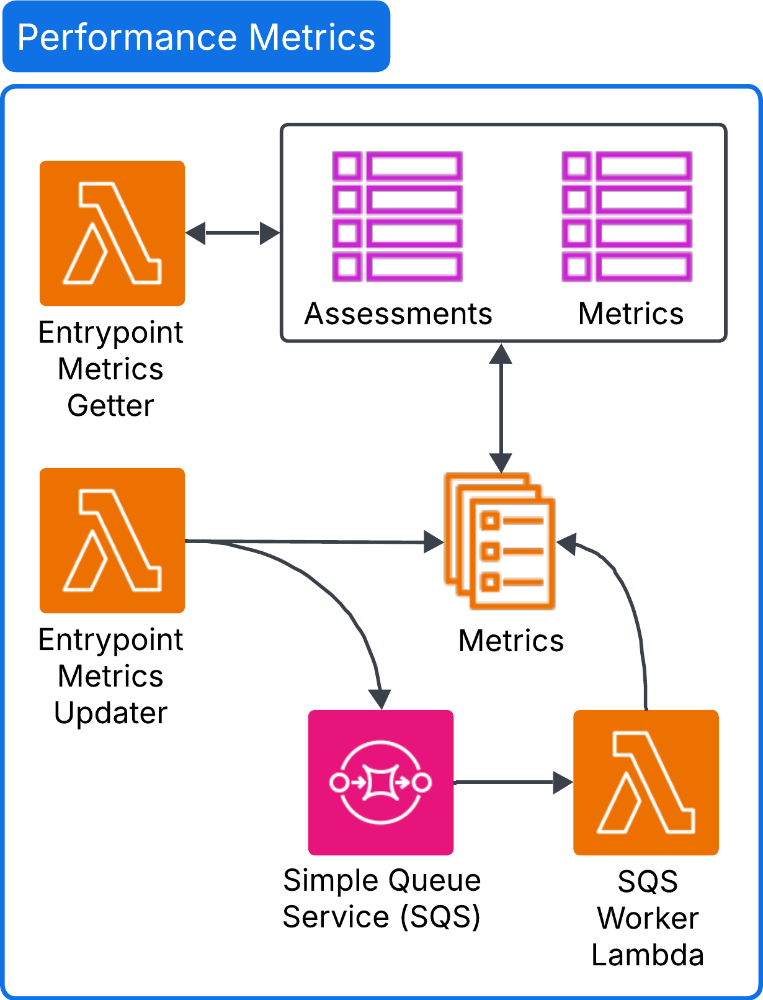

# CodeSensei
CodeSensei is a cloud-native web application that provides AI-managed coding assessments to help software engineers prepare for algorithm interviews. The app is built using a [microservices](https://en.wikipedia.org/wiki/Microservices) architecture on AWS's cloud platform to achieve reliability and scalability.

## Table of Contents
- [Features](#features)
- [System Design](#system-design)
- [Usage](#usage)
- [Contributors](#contributors)

## Features
Preparing for algorithm interviews often involves practicing a subset of LeetCode-style questions filtered by topic (e.g., arrays, graphs) and difficulty (easy, medium, hard). The selection within this subset is typically random and left to the user, making it hard to identify and focus on weak areas. CodeSensei streamlines this process by allowing users to configure their assessments, while dynamically selecting each question within that configuration based on their performance on previous ones. This enables a more personalized and targeted practice experience. To achieve this, we implemented the following features: 

#### User Authentication and Profiles
Users can sign up, log in, and maintain personalized assessment histories. Sign-ups include strong password requirements and email verification to ensure account security.


#### Assessment Configuration
Users can customize each assessment by selecting topics, difficulty levels, and the number of questions they want to attempt.


#### Code Submission
Users can submit code for each question and view its output, along with key performance metrics such as execution time, accuracy, and memory usage.


#### Chatbot Assistance
If users get stuck, they can ask the built-in chatbot for hints or clarifications. To preserve the integrity of the assessment, the chatbot does not provide code or direct answers.


#### Dynamic Question Progression
After completing a question, users can proceed to the next one, which is selected dynamically based on their performance on previous questions within the assessment.


#### Assessment Submission and Metrics
Upon completing all questions, users can submit the assessment and view detailed metrics on time spent, execution time, and memory usage, broken down by topic and difficulty. They can also view aggregate metrics across assessments to benchmark their overall performance.


## System Design

We adopted a microservices architecture composed of five core features: authentication, assessment handling, chatbot, code execution, and performance metrics. The frontend communicates with these services via HTTP requests and WebSockets through API Gateway, an AWS-managed entry point.


<br>

Data is stored in DynamoDB, a serverless NoSQL database known for scalability and performance. We maintain tables for users, assessments, question bank, and performance metrics.


<br>

Computationally intensive services of each feature are hosted on ECS with Fargate, allowing us to scale each service independently without managing servers.


<br>

The frontend is deployed via S3 and distributed globally using CloudFront, AWS's CDN service, to ensure low-latency access across regions.


<br>

AWS Cognito manages user authentication and signups. Upon signup, a Lambda function is triggered to create an entry for the user in the Users table.


<br>

The Assessment Handler receives HTTP requests via an entrypoint Lambda, which performs validation before forwarding the request to the main handler service running on ECS. This service queries the Assessment table to gather the current context, including assessment configurations (i.e., selected topics and difficulty levels) and the user’s performance on prior questions. It then passes this context to an LLM on AWS Bedrock, prompting it suggest the topic and difficulty of the next question. To efficiently retrieve matching questions, we query OpenSearch, which is indexed by topic and difficulty, enabling fast lookups without scanning and filtering the entire Questions table. A question ID is randomly selected from the retrieved list, and the corresponding full question is fetched from the Questions table. The question is then returned to the user via the entrypoint Lambda.


<br>

The Chatbot receives socket messages containing the user prompt and current question ID. After validation, the message is pushed to an SQS queue. The chatbot service, running on ECS, polls the queue, retrieves question details from the Questions table, and forwards them along with the user prompt to an LLM on Bedrock. Its response is returned to the user via WebSocket.


<br>

The Code Executor handles language-specific code evaluation. An entrypoint Lambda receives user code, question ID, and the selected language via socket. After validation, the job is sent to an SQS queue, which triggers a distributor Lambda that sends it to the appropiate executor. Each language has its own Fargate service, allowing popular languages (like Python) to scale independently. The services fetch test cases from the Questions table, execute the code, and pass the results to a Results Manager Lambda. This lambda compares them to expected outputs, updates the Assessment table accordingly, and returns results to the user via WebSocket.


<br>

The Metrics feature has two Lambda entrypoints. The getter Lambda retrieves user-wide metrics (from the Metrics table) and assessment-specific metrics (from the Assessment table), triggered when users visit their dashboard. The updater Lambda is invoked when a question is completed. It triggers jobs for metric calculation at various scopes—e.g., easy-graphs (directly to Fargate) or easy-all, all-graphs, all-all (routed through SQS, then processed by a Lambda worker). This architecture balances real-time feedback with scalable aggregation and minimizes compute/database load.



## Usage
Because CodeSensei is deployed on AWS from the terminal and implemented using AWS CDK, the below instructions assume that you have an AWS account and installed [AWS CLI](https://docs.aws.amazon.com/cli/latest/userguide/cli-chap-welcome.html) and [AWS CDK](https://docs.aws.amazon.com/cdk/v2/guide/home.html). Additionally, they expect [Node.js](https://nodejs.org/en/download/), [Docker](https://www.docker.com/), TypeScript, Python, and [Make](https://en.wikipedia.org/wiki/Make_(software)) to be installed.

CodeSensei consists of two deployments: the frontend and the infrastructure. Getting both deployed and functional isn't straightforward, as they are interdependent. For this reason, the below instructions need to be followed carefully. 

1. Install all package dependencies
   ```bash
   make install_prereq
2. Build the react app for frontend deployment
   ```bash
   make build_frontend
4. Deploy the frontend (takes ~10 minutes)
   ```bash
   make deploy_frontend
7. Deploy the infrastructure (takes ~30 minutes)
   ```bash
   make deploy_infra
9. Extract the following variables from the deployments using the AWS console:
   - `frontend url` from CloudFront
   - `client id` from Cognito (see app client settings)
   - `authority` from Cognito (see domain in app client settings)
   - `socket url` from API Gateway (see socket API)
   - `http url` from API Gateway (see http API)
10. In Cognito, replace the allowed callback URLs in the app client settings with `frontend url`
11. Duplicate `.env.example` in `./frontend/`
    ```bash
    cp frontend/.env.example frontend/.env
13. Fill in the following variables in `frontend/.env` using values obtained from step 5:
    ```bash
    CLIENT_ID=<client id>
    AUTHORITY=<authority>
    SOCKET_URL=<socket url>
    HTTP_URL=<http url>
    REDIRECT_URL=<frontend url>
11. Generate an env file in the frontend build for deployment
    ```bash
    make gen_frontend_env
13. Re-deploy the frontend with the env file (takes ~3 minutes)
    ```bash
    make deploy_frontend
14. Seed the Questions DynamoDB table with sample questions
    ```bash
    make seed_dynamo questions
15. Index the OpenSearch service using data from the Questions table (may need to run twice)
    ```bash
    make seed_opensearch
16. Destroy the resources when done
    ```bash
    make destroy_all

Note: The deployment will cost under $5, but it's important to destroy the resources as soon as you're done with it. Leaving idle resources running (e.g., Fargate services, API Gateway, DynamoDB tables) can lead to unnecessary charges over time.

## Contributors
- Aaron Bengochea
- Timothy Cao
- Janardhan Reddy
- Allan Thekkepeedika
